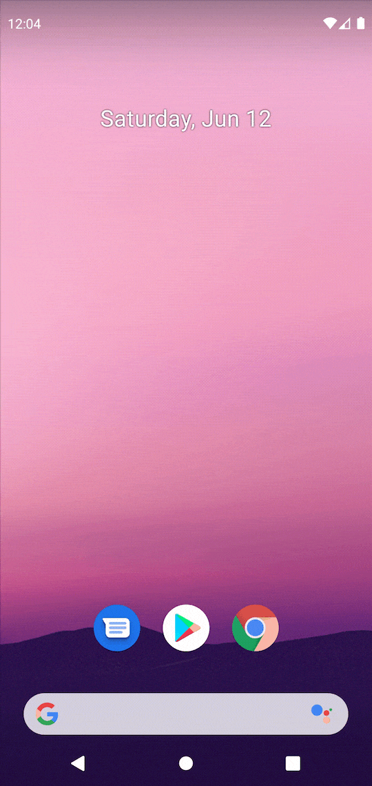

# QuickRoute

Using Quick Settings Tile to navigate to Developer options page without click a lot of buttons.

## Preview

## Install

1. Can install from Google Play directly [here](https://play.google.com/store/apps/details?id=com.jintin.quickroute).

2. Pull the source and run on your own device.

## Contributing

Bug reports and pull requests are welcome on GitHub at <https://github.com/Jintin/QuickRoute>.

## License

**QuickRoute** is released under Apache License 2.0.
See [LICENSE](https://github.com/Jintin/QuickRoute/blob/master/LICENSE) for more details.